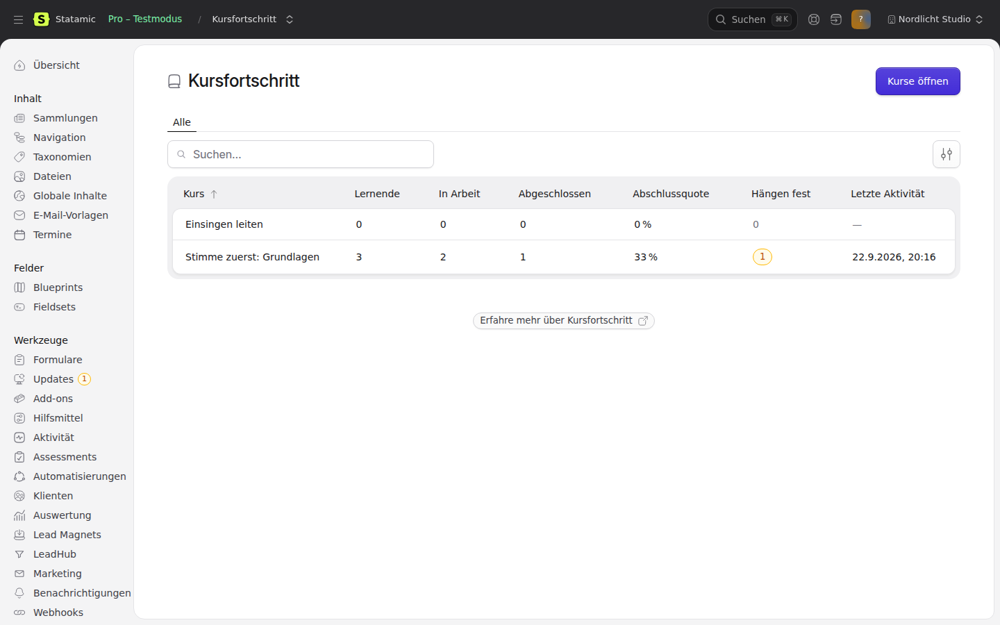
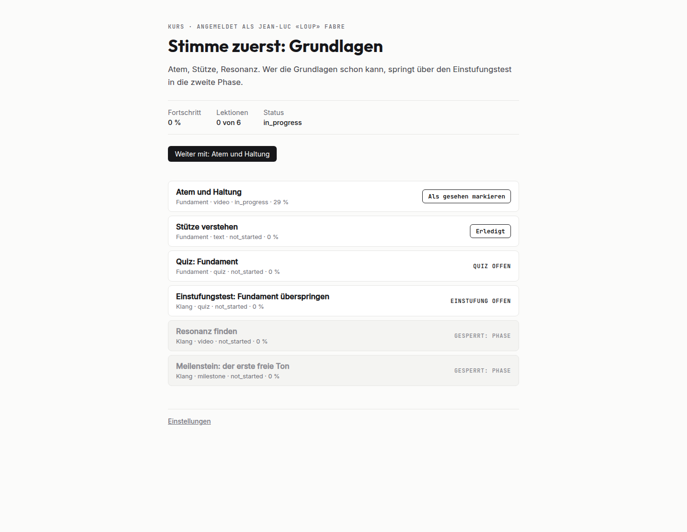

# Statamic Courses

Courses for Statamic 6: modules and lessons as entries, a state per learner and lesson, sequencing,
drip by schedule or by progress, and a progress rollup. Access to a course is asked of
[statamic-entitlements](https://github.com/goldnead/statamic-entitlements). Antlers tags and a
form route for the front end, and a "Course Progress" screen in the Control Panel.

Commercial, single edition (`pro`).

<p>
  
  
</p>

## Requirements

- PHP 8.2+, Laravel 12.40+ or 13, Statamic 6
- Optional: goldnead/statamic-entitlements 1.3+ (without it, or your own `CourseAccess`, every course is closed)

## Install

```bash
composer require goldnead/statamic-courses
php artisan migrate
php artisan courses:install   # collections `courses` and `course_lessons`, blueprints, routes
```

Collection handles are configurable in `config/courses.php` before installing. The install routes
courses at `/courses/{slug}` and lessons at `/courses/{course_slug}/{slug}`; change or clear the
routes as you like, `url` is then null and nothing breaks.

## Structure

A **course** entry carries `sequencing_mode` (`none`, `section`, `lesson`), `drip_mode` (see
below) and `product`, the entitlements product that opens it (defaults to the course slug), plus
`bundles`, `team_seats`, `on_payment_failure` and `section_audiences`.

Upgrading from 0.1: run `php artisan migrate`, then `php artisan courses:install --merge`. It adds
the fields and select options the site's blueprints lack and changes nothing else; see first with
`--merge --dry-run`. (`--force` rewrites both blueprints and loses fields added by hand.)

A **lesson** entry points at its course (`course`) and orders itself with `section_key`,
`section_order` and `sort_order`. Optional: `phase_key` / `phase_order` (later phases wait for
earlier ones), `is_test_out`, `week` (with schedule drip), `prerequisite_lessons`, `item_type` and
`video_duration` (`mm:ss`).

`item_type` decides how a lesson completes:

| Type | Completes by |
|---|---|
| `video` (default) | watching past `auto_completion_threshold` (90 %), or the learner's own tick |
| `text`, `milestone`, `coaching`, `exercise` | `acknowledgeLesson()`; a milestone also by itself once its phase is done |
| `quiz`, `assignment`, `reflection` (`proof_required_types`) | only `completeLesson()`, called by the code that checked the proof |
| anything else | the learner's tick or `completeLesson()` |

## What locks a lesson

1. The course's `sequencing_mode`.
2. Its prerequisites, until each is completed.
3. Its phase, until every earlier phase is completed. A test-out lesson stays open; completing it
   completes the earlier phases as `skipped`.
4. The course's drip (`drip_mode`), with the lesson field it reads:

   | `drip_mode` | Lesson field | Opens |
   |---|---|---|
   | `schedule` | `week` | week *n* opens `(n − 1) × 7` days after enrollment, or earlier with `advanceToWeek()` |
   | `days` | `drip_after` | *n* days after enrollment |
   | `date` | `drip_date` | on that day, in `statamic.system.display_timezone` (else app.timezone) |
   | `day_of_month` | `drip_after` | the *n*th time the course's `drip_day_of_month` comes round, the enrollment day included |
   | `payments` | `drip_after` | once *n* payments went through (the first included) |
   | `after_trial` | `drip_after` ≥ 1 | once the first charge after a trial went through; at once without a trial |

   Payments are recorded by the statamic-payments bridge (Stripe and Mollie alike) or by
   `Courses::recordBilling()`. A lesson without the field opens at once.

A completed lesson is never locked. Writes to a locked lesson are refused. Each locked lesson
carries a `lock_reason`: `schedule`, `payment`, `paused`, `prerequisite`, `phase` or `sequence`.

## Who sees a lesson

A lesson (`audience_entitlements`, `audience_groups`, `audience_tags`, `audience_segments`) or a
whole section (the course's `section_audiences`) can be limited to some learners: product
handles, Statamic user groups, LeadHub tags, LeadHub segments. One match is enough. For everybody
else the lesson is not part of the course: it is not listed, not counted, and does not lock the
path. Tags and segments need statamic-leadhub; without it such a rule matches nobody.

## When a payment fails

`on_payment_failure` on the course, applied when statamic-payments reports a failed cycle
(`SubscriptionCycleFailed`) and lifted on the next renewal:

- `keep` (default): nothing; access runs out at the end of the paid period, as entitlements has it.
- `pause_drip`: the drip clock stops. Afterwards every relative release date moves on by the
  length of the pause.
- `revoke`: what that subscription paid for is taken away until the payment arrives. Any other
  source still opens the course: a lifetime grant, a bundle, another subscription, a team seat.
  A new purchase lifts the hold at once.

Holds show on the Course Progress screen under **Payment holds**, where somebody with the
permission `manage course holds` can lift one. Without payments: `Courses::paymentFailed()`, `paymentRecovered()`, `pauseDrip()`,
`resumeDrip()`, `suspendAccess()`, `restoreAccess()`.

## Bundles and teams

A course opens for its `product` and for every product listed under `bundles`: sell one bundle
product and list it on each course it contains. (A PackageResolver in entitlements works as well.)

`team_seats` lets a buyer add that many people by email (`Courses::addTeamMember()`, the
`courses:team_form` tag). Seats belong to the purchase: bought through a bundle, one team with the
same members covers every course of the bundle, and the seat count is the highest `team_seats`
among those courses. A member gets in with that address for as long as the buyer holds the
purchase. statamic-entitlements has no seats of its own yet; the team lives in
`courses_team_members`, one row per seat.

## Lesson content

Besides the markdown `content` (kept, rendered first), a lesson has `blocks`: text, callout,
columns, FAQ, video (YouTube and Vimeo become players; with statamic-consent installed they wait
behind `{{ consent:gate }}` for the `youtube` or `vimeo` service), download and button.

A download marked “only for learners of this course” takes its file from its own field on
statamic-private-media's container and is served through a link signed for `course:<slug>`.
courses answers private-media for that resource with `Courses::canAccess()`, so buyers, team
members and bundle holders all get the file. Public and private downloads sit side by side.
Without private-media the toggle is not offered. `courses:install` points the public field at
`courses.downloads.container` or the first container other than the private one.

## Quiz

A quiz lesson names a statamic-assessments questionnaire (`assessment`) and optionally
`assessment_min_score` and `assessment_pass_levels`. When the signed-in learner submits it, a pass completes the lesson
(source `assessment`, opening whatever waited on it) and a fail records the attempt.

## Usage

```php
use Goldnead\Courses\Facades\Courses;

Courses::canAccess($user, 'cvt-101');              // entitlements decides
Courses::enroll($user, 'cvt-101');                 // starts the drip clock
Courses::outline($user, 'cvt-101');                // sections, lessons, progress, locks, rollup
Courses::summary($user, 'cvt-101');                // status, percent, continue_lesson
Courses::lessons($user, 'cvt-101');                // flat, in reading order
Courses::lesson($user, 'cvt-101', 'intro');
Courses::updateLessonProgress($user, 'cvt-101', 'intro', ['watched_seconds' => 540, 'resume_seconds' => 540]);
Courses::setLessonCompletion($user, 'cvt-101', 'intro', true);
Courses::acknowledgeLesson($user, 'cvt-101', 'reading');
Courses::updateLessonItem($user, 'cvt-101', 'quiz-1', ['attempts' => 1, 'best_score' => 40]);
Courses::completeLesson($user, 'cvt-101', 'quiz-1', 'quiz', ['best_score' => 90]);
```

`updateLessonProgress()` is for videos only and trusts the entry's `video_duration` over the
player's; the player's number counts only when the entry has none.

`$user` is a Statamic user, any `Authenticatable`, or an id. Reads never check access; ask
`canAccess()` first.

Events: `LessonCompleted` on every transition to completed (with its source), `CourseCompleted` once
per learner and course, `LearnerEnrolled`, `LessonUnlocked` (for unlocks a write caused),
`QuizPassed`, `QuizFailed`, `DripPaused`, `DripResumed`, `CourseAccessSuspended`,
`CourseAccessRestored`, `TeamMemberAdded`, `TeamMemberRemoved`. Every start, quarter mark and completion is logged to
`courses_lesson_events`. All tables carry the `courses_` prefix.

## Antlers

All tags work for the signed-in learner. Without access to the course they render nothing.

```antlers
{{ courses only="accessible" }}
    <a href="{{ url }}">{{ title }}</a> {{ progress:percent }} %
{{ /courses }}

{{ courses:progress course="cvt-101" }}{{ completed_lessons }}/{{ total_lessons }}{{ /courses:progress }}

{{ courses:lessons course="cvt-101" }}
    {{ title }}: {{ if is_completed }}done{{ elseif is_locked }}{{ lock_reason }}{{ else }}open{{ /if }}
{{ /courses:lessons }}

{{ courses:continue course="cvt-101" }}<a href="{{ url }}">Continue with {{ title }}</a>{{ /courses:continue }}

{{ courses:form course="cvt-101" lesson="reading" do="acknowledge" redirect="/courses/cvt-101" }}
    <button>Mark as read</button>
{{ /courses:form }}

{{# on a lesson page #}}
{{ courses:blocks }}
{{ courses:quiz }}{{ if passed }}Passed{{ else }}<a href="{{ url }}">Take the quiz</a>{{ /if }}{{ /courses:quiz }}

{{ courses:team course="cvt-101" }}{{ left }} of {{ seats }} seats free{{ /courses:team }}
{{ courses:team_form course="cvt-101" }}<input type="email" name="email"> <button>Add</button>{{ /courses:team_form }}
```

`courses:blocks` renders the shipped partials (override one at
`resources/views/vendor/courses/blocks/{type}.antlers.html`) or, as a pair, hands over the blocks.
It renders nothing for a lesson that is locked or hidden for the learner; super users see every
lesson. `courses:team_form` posts to `POST /!/courses/team` (`action` `add` or `remove`, `email`);
refusals: `not_owner` (403), `no_seat` (422).

`courses:form` posts to `POST /!/courses/progress` (fields `course`, `lesson`, `action` =
`complete`, `incomplete`, `acknowledge` or `progress`, plus `watched_seconds` / `resume_seconds`).
The route needs a signed-in user with access to the course, carries CSRF, answers JSON when asked
and otherwise redirects back or to a local `_redirect`. A refusal carries a reason code, as
`{"error": "…"}` in JSON and as the flashed `courses` error (`{{ get_error:courses }}`) on a form
post: `no_access` (403), `unknown_course` (404), `unknown_lesson`, `locked`, `proof_required`,
`not_video`, `not_acknowledgeable` (422). `Courses::refusalReason()` gives the same answer in PHP.

In `courses:lessons`, a lesson a test-out completed has `status: skipped` and `is_skipped: true`;
its `progress:status` stays `completed`. Switch it off with `COURSES_ROUTES_ENABLED=false`; the form tag then renders
nothing.

## Control Panel

**Course Progress** (permission `view course progress`): per course the learners, how many are in
progress or completed, the completion rate among those who started, how many are stuck (no
activity for `cp.stuck_after_days`, default 14) and the last activity. It sits in the suite's shared
nav section when statamic-payments provides one, under Content otherwise.

## Access

`Goldnead\Courses\Contracts\CourseAccess` is the seam. With statamic-entitlements installed it asks
`Entitlements::allows()`; without it every course is closed.

How a learner reaches entitlements: an Eloquent model passes through; a Statamic eloquent user
(`User::current()` on an eloquent install) is unwrapped to its model; anything else is looked up as
subject type `courses.entitlements.subject_type`. Unset, that is the auth model's morph class on an
eloquent install and `user` on a flat-file one.

A host with its own access rules binds its own implementation, and it wins over the default:

```php
$this->app->bind(\Goldnead\Courses\Contracts\CourseAccess::class, MyCourseAccess::class);
```

## Tests

```bash
composer test
DB_DRIVER=mysql DB_PORT=3306 composer test:mysql
```
